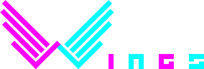

Object-oriented Component-based UI JavaScript library for HTML Canvas (inspired by Java Swing)

## Installation

```sh
$ npm i @b00tc4mp/wings
```

## Usage

```html
<!-- create a canvas in html -->
<canvas id="view" width="300px" height="300px">
```

```js
// import wings in javascript (esm)
import Wings from '@b00tc4mp/wings'
// or require it (cjs)
// const Wings = require('@b00tc4mp/wings')

// destructure it
const { View, Component } = Wings

// instantiate a view linked to a canvas
const view = new View(document.getElementById('toggling-saluter'))

// create a saluter abstraction
class TogglingSaluter extends Component {
	constructor(hello, bye) {
		super()

		// set the dimensions
		this.width = 150
		this.height = 50

		// set colors
		this.backgroundColor = 'magenta'
		this.borderColor = 'cyan'
		this.borderWidth = 5

		// set the text height for the salutation
		this.textHeight = 16

		// init the salutation value 
		this.hello = hello
		this.bye = bye
		this.salutation = this.hello

		// add behavior to toggle the salutation on click
		this.on('MouseClick', () => {
			if (this.salutation === this.hello)
				this.salutation = this.bye
			else
				this.salutation = this.hello
		})
	}

	paint(context) {
		// paint the base layer
		super.paint(context)

		// paint the saluter value centered in the component
		context.fillStyle = 'white'
		context.font = this.textHeight + 'px verdana'
		const width = context.measureText(this.salutation).width
		context.fillText(
			this.salutation,
			(this.width - width) / 2,
			(this.height + this.textHeight) / 2
		)
	}
}

// instantiate a saluter and center it at the top of the view
const saluter = new TogglingSaluter('Hello, World!', 'Bye, World!')

saluter.x = (view.width - saluter.width) / 2
saluter.y = (view.height / 3 - saluter.height) / 2

// add the saluter to the view
view.add(saluter)

// instantiate a saluter and center it in the view
const saluter2 = new TogglingSaluter('Hola Mundo!', 'Adiós, Mundo!')

saluter2.x = (view.width - saluter2.width) / 2
saluter2.y = (view.height - saluter2.height) / 2

// add the saluter to the view
view.add(saluter2)

// instantiate a saluter and center it at the bottom of the view
const saluter3 = new TogglingSaluter('Ciao Mondo!', 'Addio, Mondo!')

saluter3.x = (view.width - saluter3.width) / 2
saluter3.y = (view.height * 5 / 3 - saluter3.height) / 2

// add the saluter to the view
view.add(saluter3)

// and that's it
```

See more examples at https://b00tc4mp.github.io/wings